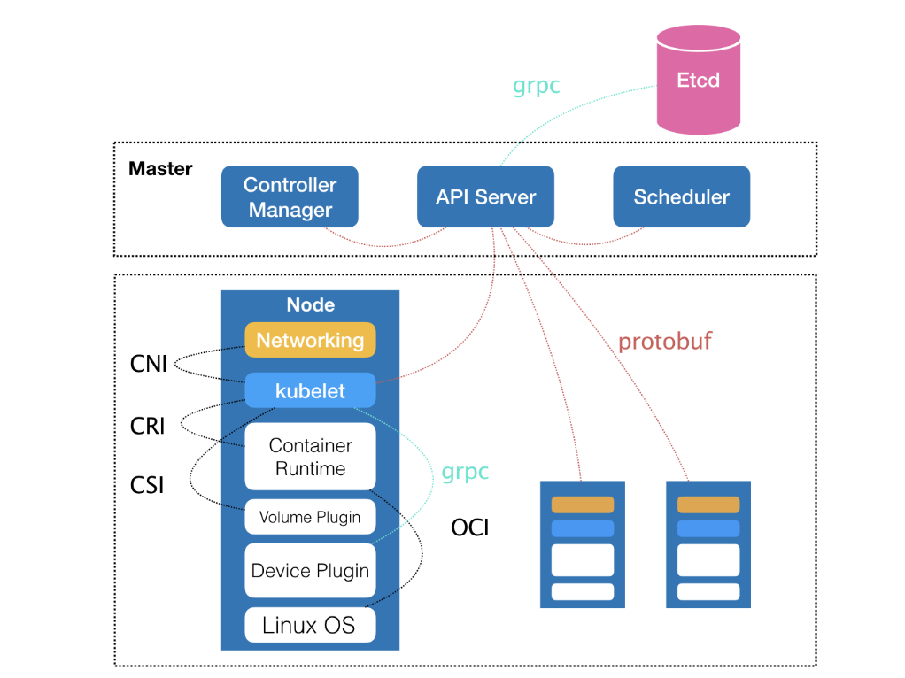
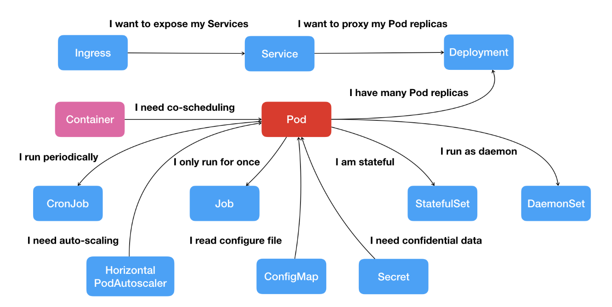

#  Kubernetes 全局架构

Master 和 Node 两种节点组成，而这两种角色分别对应着控制节点和计算节点

由三个紧密协作的独立组件组合而成，它们分别是  
负责 API 服务的 kube-apiserver    
负责调度的 kube-scheduler  
负责容器编排的 kube-controller-manager  
整个集群的持久化数据，则由 kube-apiserver 处理后保存在 Ectd 中。

而计算节点上最核心的部分，则是一个叫作 kubelet 的组件。

##  容器之间的额关系
而 Kubernetes 项目要着重解决的问题，则来自于 Borg 的研究人员在论文中提到的一个非常重要的观点：

运行在大规模集群中的各种任务之间，实际上存在着各种各样的关系。这些关系的处理，才是作业编排和管理系统最困难的地方。

事实也正是如此。

其实，这种任务与任务之间的关系，在我们平常的各种技术场景中随处可见。比如，一个 Web 应用与数据库之间的访问关系，一个负载均衡器和它的后端服务之间的代理关系，一个门户应用与授权组件之间的调用关系。

如果只做到“封装微服务、调度单容器”这一层次，Docker Swarm 项目就已经绰绰有余了。如果再加上 Compose 项目，你甚至还具备了处理一些简单依赖关系的能力

如果我们现在的需求是，要求这个项目能够处理前面提到的所有类型的关系，甚至还要能够支持未来可能出现的更多种类的关系呢？

Kubernetes 项目最主要的设计思想是，从更宏观的角度，以统一的方式来定义任务之间的各种关系，并且为将来支持更多种类的关系留有余地。

## pod
在常规环境下，这些应用往往会被直接部署在同一台机器上，通过 Localhost 通信，通过本地磁盘目录交换文件。而在 Kubernetes 项目中，这些容器则会被划分为一个“Pod”，Pod 里的容器共享同一个 Network Namespace、同一组数据卷，从而达到高效率交换信息的目的。

另外一种更为常见的需求，比如 Web 应用与数据库之间的访问关系，Kubernetes 项目则提供了一种叫作“Service”的服务。

## service
Kubernetes 项目的做法是给 Pod 绑定一个 Service 服务，而 Service 服务声明的 IP 地址等信息是“终生不变”的。这个Service 服务的主要作用，就是作为 Pod 的代理入口（Portal），从而代替 Pod 对外暴露一个固定的网络地址。

对于 Web 应用的 Pod 来说，它需要关心的就是数据库 Pod 的 Service 信息。不难想象，Service 后端真正代理的 Pod 的 IP 地址、端口等信息的自动更新、维护，则是 Kubernetes 项目的职责。

## 生态 api
围绕着容器和 Pod 不断向真实的技术场景扩展，我们就能够摸索出一幅如下所示的 Kubernetes 项目核心功能的“全景图”

按照这幅图的线索，我们从容器这个最基础的概念出发，首先遇到了容器间“紧密协作”关系的难题，于是就扩展到了 Pod；有了 Pod 之后，我们希望能一次启动多个应用的实例，这样就需要 Deployment 这个 Pod 的多实例管理器；而有了这样一组相同的 Pod 后，我们又需要通过一个固定的 IP 地址和端口以负载均衡的方式访问它，于是就有了 Service。

除了应用与应用之间的关系外，应用运行的形态是影响“如何容器化这个应用”的第二个重要因素。

为此，Kubernetes 定义了新的、基于 Pod 改进后的对象。比如 Job，用来描述一次性运行的 Pod（比如，大数据任务）；再比如 DaemonSet，用来描述每个宿主机上必须且只能运行一个副本的守护进程服务；又比如 CronJob，则用于描述定时任务等等。

如此种种，正是 Kubernetes 项目定义容器间关系和形态的主要方法。

相比之下，在 Kubernetes 项目中，我们所推崇的使用方法是：

可以看到，Kubernetes 项目并没有像其他项目那样，为每一个管理功能创建一个指令，然后在项目中实现其中的逻辑。这种做法，的确可以解决当前的问题，但是在更多的问题来临之后，往往会力不从心。

> 那么kubernetes怎么做的

首先，通过一个“编排对象”，比如 Pod、Job、CronJob 等，来描述你试图管理的应用；
然后，再为它定义一些“服务对象”，比如 Service、Secret、Horizontal Pod Autoscaler（自动水平扩展器）等。这些对象，会负责具体的平台级功能。
这种使用方法，就是所谓的“声明式 API”。这种 API 对应的“编排对象”和“服务对象”，都是 Kubernetes 项目中的 API 对象（API Object）。

## Kubernetes 项目如何启动一个容器化任务呢？

传统  
如果是自己 DIY 的话，可能需要启动两台虚拟机，分别安装两个 Nginx，然后使用 keepalived 为这两个虚拟机做一个虚拟 IP。

k8s  
而如果使用 Kubernetes 项目呢？你需要做的则是编写如下这样一个 YAML 文件（比如名叫 nginx-deployment.yaml）：
$ kubectl create -f nginx-deployment.yaml

## 和其他集群管理的区别
实际上，过去很多的集群管理项目（比如 Yarn、Mesos，以及 Swarm）所擅长的，都是把一个容器，按照某种规则，放置在某个最佳节点上运行起来。这种功能，我们称为“调度”。

而 Kubernetes 项目所擅长的，是按照用户的意愿和整个系统的规则，完全自动化地处理好容器之间的各种关系。这种功能，就是我们经常听到的一个概念：编排。

