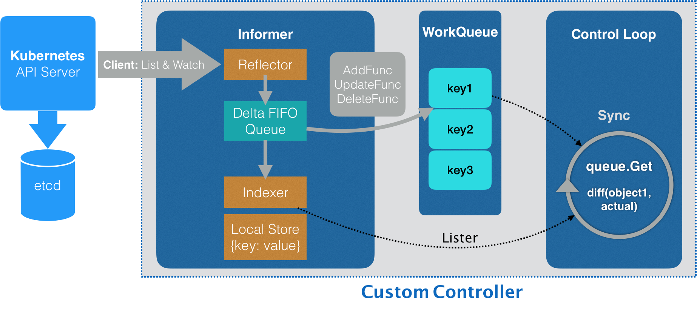

# 控制器

“声明式 API”并不像“命令式 API”那样有着明显的执行逻辑。这就使得基于声明式 API 的业务功能实现，往往需要通过控制器模式来“监视”API 对象的变化（比如，创建或者删除 Network），然后以此来决定实际要执行的具体工作。

编写自定义控制器代码的过程包括：编写 main 函数、编写自定义控制器的定义，以及编写控制器里的业务逻辑三个部分。

## 这个 main 函数主要通过三步完成了初始化并启动一个自定义控制器的工作

第一步：main 函数根据我提供的 Master 配置（APIServer 的地址端口和 kubeconfig 的路径），创建一个 Kubernetes 的 client（kubeClient）和 Network 对象的 client（networkClient）。

第二步：main 函数为 Network 对象创建一个叫作 InformerFactory（即：networkInformerFactory）的工厂，并使用它生成一个 Network 对象的 Informer，传递给控制器。

第三步：main 函数启动上述的 Informer，然后执行 controller.Run，启动自定义控制器。

至此，main 函数就结束了。

## 自定义控制器的工作原理

这个控制器要做的第一件事，是从 Kubernetes 的 APIServer 里获取它所关心的对象，也就是我定义的 Network 对象。

同步本地缓存的工作，是 Informer 的第一个职责，也是它最重要的职责。

Informer 的第二个职责，则是根据这些事件的类型，触发事先注册好的 ResourceEventHandler

前面在 main 函数里创建了两个 client（kubeclientset 和 networkclientset），然后在这段代码里，使用这两个 client 和前面创建的 Informer，初始化了自定义控制器

为 networkInformer 注册了三个 Handler（AddFunc、UpdateFunc 和 DeleteFunc），分别对应 API 对象的“添加”“更新”和“删除”事件。而具体的处理操作，都是将该事件对应的 API 对象加入到工作队列中。

所谓 Informer，其实就是一个带有本地缓存和索引机制的、可以注册 EventHandler 的 client 自定义控制器跟 APIServer 进行数据同步的重要组件  
更具体地说，Informer 通过一种叫作 ListAndWatch 的方法，把 APIServer 中的 API 对象缓存在了本地，并负责更新和维护这个缓存。  
其中，ListAndWatch 方法的含义是：首先，通过 APIServer 的 LIST API“获取”所有最新版本的 API 对象；然后，再通过 WATCH API 来“监听”所有这些 API 对象的变化

可以看到，启动控制循环的逻辑非常简单：

首先，等待 Informer 完成一次本地缓存的数据同步操作；  
然后，直接通过 goroutine 启动一个（或者并发启动多个）“无限循环”的任务。  

而这个“无限循环”任务的每一个循环周期，执行的正是我们真正关心的业务逻辑。

## 期望状态
而如果能够获取到对应的 Network 对象，我就可以执行控制器模式里的对比“期望状态”和“实际状态”的逻辑了。

其中，自定义控制器“千辛万苦”拿到的这个 Network 对象，正是 APIServer 里保存的“期望状态”，即：用户通过 YAML 文件提交到 APIServer 里的信息。当然，在我们的例子里，它已经被 Informer 缓存在了本地。

## 实际状态
那么，“实际状态”又从哪里来呢？

当然是来自于实际的集群了。

所以，我们的控制循环需要通过 Neutron API 来查询实际的网络情况。

# 总结
剖析了 Kubernetes API 编程范式的具体原理，并编写了一个自定义控制器。

这其中，有如下几个概念和机制，是你一定要理解清楚的：

所谓的 Informer，就是一个自带缓存和索引机制，可以触发 Handler 的客户端库。这个本地缓存在 Kubernetes 中一般被称为 Store，索引一般被称为 Index。

Informer 使用了 Reflector 包，它是一个可以通过 ListAndWatch 机制获取并监视 API 对象变化的客户端封装。

Reflector 和 Informer 之间，用到了一个“增量先进先出队列”进行协同。而 Informer 与你要编写的控制循环之间，则使用了一个工作队列来进行协同。

在实际应用中，除了控制循环之外的所有代码，实际上都是 Kubernetes 为你自动生成的，即：pkg/client/{informers, listers, clientset}里的内容。

而这些自动生成的代码，就为我们提供了一个可靠而高效地获取 API 对象“期望状态”的编程库。

所以，接下来，作为开发者，你就只需要关注如何拿到“实际状态”，然后如何拿它去跟“期望状态”做对比，从而决定接下来要做的业务逻辑即可。

以上内容，就是 Kubernetes API 编程范式的核心思想。